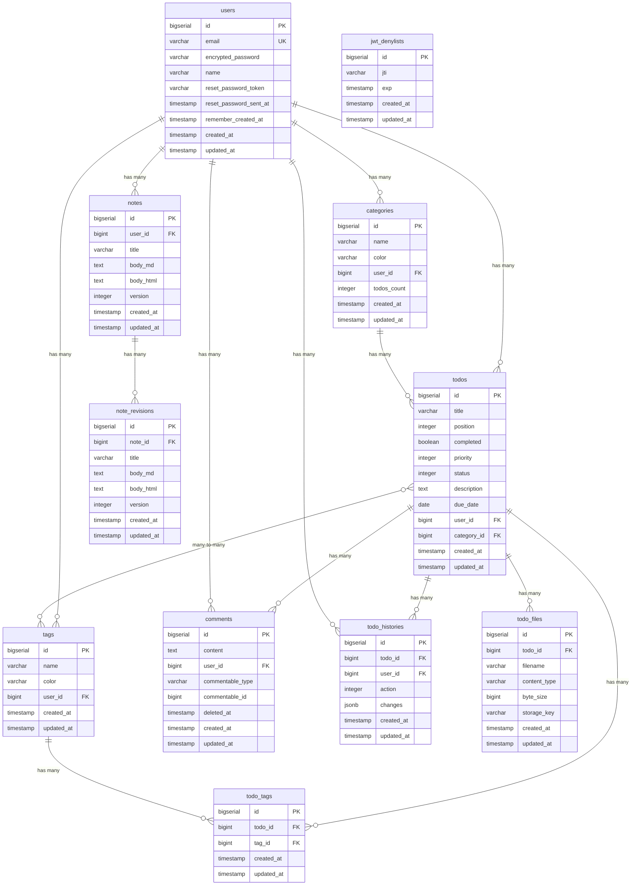

# Database Architecture

## Overview

- **Database System**: PostgreSQL 15
- **ORM**: GORM (Go)
- **Migrations**: GORM AutoMigrate (development)
- **Container**: Runs in Docker with persistent volume

## Entity Relationship Diagram



### 主要な関係性

1. **User → Todos**: 1対多の関係。各ユーザーは複数のTodoを持つ
2. **User → Categories**: 1対多の関係。各ユーザーは複数のカテゴリーを持つ
3. **User → Tags**: 1対多の関係。各ユーザーは複数のタグを持つ
4. **User → Notes**: 1対多の関係。各ユーザーは複数のノートを持つ
5. **Category → Todos**: 1対多の関係。各カテゴリーは複数のTodoを含む（オプション）
6. **Todo ↔ Tags**: 多対多の関係。TodoTagsテーブルを介して実現
   - 1つのTodoは複数のタグを持てる
   - 1つのタグは複数のTodoに付けられる
7. **Todo → Comments**: 1対多の関係（ポリモーフィック）。各Todoは複数のコメントを持つ
8. **User → Comments**: 1対多の関係。各ユーザーは複数のコメントを投稿できる
9. **Todo → TodoHistories**: 1対多の関係。各Todoは複数の履歴エントリを持つ
10. **User → TodoHistories**: 1対多の関係。変更を行ったユーザーを記録
11. **Todo → TodoFiles**: 1対多の関係。各Todoは複数のファイルを添付できる
12. **Note → NoteRevisions**: 1対多の関係。各Noteは複数のリビジョンを持つ（最大50件）

## Schema Details

### users table
```sql
CREATE TABLE users (
  id bigserial PRIMARY KEY,
  email varchar DEFAULT '' NOT NULL,
  encrypted_password varchar DEFAULT '' NOT NULL,
  name varchar NOT NULL,
  reset_password_token varchar,
  reset_password_sent_at timestamp,
  remember_created_at timestamp,
  created_at timestamp(6) NOT NULL,
  updated_at timestamp(6) NOT NULL
);

CREATE UNIQUE INDEX index_users_on_email ON users(email);
CREATE UNIQUE INDEX index_users_on_reset_password_token ON users(reset_password_token);
```

**Purpose**: Stores user account information for authentication
**Key Fields**:
- `email`: Unique identifier for login
- `encrypted_password`: Bcrypt hashed password
- `name`: Display name for the user

### todos table
```sql
CREATE TABLE todos (
  id bigserial PRIMARY KEY,
  title varchar NOT NULL,
  position integer,
  completed boolean DEFAULT false,
  priority integer DEFAULT 1 NOT NULL,
  status integer DEFAULT 0 NOT NULL,
  description text,
  due_date date,
  user_id bigint NOT NULL,
  category_id bigint,
  created_at timestamp(6) NOT NULL,
  updated_at timestamp(6) NOT NULL,
  FOREIGN KEY (user_id) REFERENCES users(id),
  FOREIGN KEY (category_id) REFERENCES categories(id)
);

CREATE INDEX index_todos_on_position ON todos(position);
CREATE INDEX index_todos_on_priority ON todos(priority);
CREATE INDEX index_todos_on_status ON todos(status);
CREATE INDEX index_todos_on_user_id ON todos(user_id);
CREATE INDEX index_todos_on_category_id ON todos(category_id);
```

**Purpose**: Stores todo items for each user
**Key Fields**:
- `title`: Todo description (required)
- `position`: Order in the list (for drag-and-drop)
- `completed`: Task completion status
- `priority`: Priority level (0=low, 1=medium, 2=high) with default medium
- `status`: Task status (0=pending, 1=in_progress, 2=completed) with default pending
- `description`: Optional detailed description (TEXT type)
- `due_date`: Optional deadline
- `user_id`: Owner of the todo (foreign key)
- `category_id`: Optional category assignment (foreign key)

### categories table
```sql
CREATE TABLE categories (
  id bigserial PRIMARY KEY,
  name varchar NOT NULL,
  color varchar NOT NULL,
  user_id bigint NOT NULL,
  todos_count integer DEFAULT 0 NOT NULL,  -- COUNTER CACHE
  created_at timestamp(6) NOT NULL,
  updated_at timestamp(6) NOT NULL,
  FOREIGN KEY (user_id) REFERENCES users(id)
);

CREATE INDEX index_categories_on_user_id ON categories(user_id);
CREATE UNIQUE INDEX index_categories_on_user_id_and_name ON categories(user_id, name);
```

**Purpose**: Stores user-defined categories for organizing todos
**Key Fields**:
- `name`: Category name (required, unique per user)
- `color`: HEX color code for visual organization
- `user_id`: Owner of the category (foreign key)
- `todos_count`: **Counter cache** for efficient todo counting (eliminates N+1 queries)

### tags table
```sql
CREATE TABLE tags (
  id bigserial PRIMARY KEY,
  name varchar NOT NULL,
  color varchar NOT NULL,
  user_id bigint NOT NULL,
  created_at timestamp(6) NOT NULL,
  updated_at timestamp(6) NOT NULL,
  FOREIGN KEY (user_id) REFERENCES users(id)
);

CREATE INDEX index_tags_on_user_id ON tags(user_id);
CREATE UNIQUE INDEX index_tags_on_user_id_and_name ON tags(user_id, name);
```

**Purpose**: Stores user-defined tags for flexible todo organization
**Key Fields**:
- `name`: Tag name (required, unique per user)
- `color`: HEX color code for visual identification
- `user_id`: Owner of the tag (foreign key)

### todo_tags table
```sql
CREATE TABLE todo_tags (
  id bigserial PRIMARY KEY,
  todo_id bigint NOT NULL,
  tag_id bigint NOT NULL,
  created_at timestamp(6) NOT NULL,
  updated_at timestamp(6) NOT NULL,
  FOREIGN KEY (todo_id) REFERENCES todos(id),
  FOREIGN KEY (tag_id) REFERENCES tags(id)
);

CREATE INDEX index_todo_tags_on_todo_id ON todo_tags(todo_id);
CREATE INDEX index_todo_tags_on_tag_id ON todo_tags(tag_id);
CREATE UNIQUE INDEX index_todo_tags_on_todo_id_and_tag_id ON todo_tags(todo_id, tag_id);
```

**Purpose**: Junction table for many-to-many relationship between todos and tags
**Key Fields**:
- `todo_id`: Reference to todo (foreign key)
- `tag_id`: Reference to tag (foreign key)
- Unique constraint ensures a todo can have each tag only once

### jwt_denylists table
```sql
CREATE TABLE jwt_denylists (
  id bigserial PRIMARY KEY,
  jti varchar NOT NULL,
  exp timestamp NOT NULL,
  created_at timestamp(6) NOT NULL,
  updated_at timestamp(6) NOT NULL
);

CREATE INDEX index_jwt_denylists_on_jti ON jwt_denylists(jti);
```

**Purpose**: Stores revoked JWT tokens for logout functionality
**Key Fields**:
- `jti`: JWT ID (unique identifier for each token)
- `exp`: Token expiration time

### comments table
```sql
CREATE TABLE comments (
  id bigserial PRIMARY KEY,
  content text NOT NULL,
  user_id bigint NOT NULL,
  commentable_type varchar NOT NULL,
  commentable_id bigint NOT NULL,
  deleted_at timestamp,
  created_at timestamp(6) NOT NULL,
  updated_at timestamp(6) NOT NULL,
  FOREIGN KEY (user_id) REFERENCES users(id)
);

CREATE INDEX index_comments_on_user_id ON comments(user_id);
CREATE INDEX index_comments_on_commentable_type_and_commentable_id 
  ON comments(commentable_type, commentable_id);
CREATE INDEX index_comments_on_deleted_at ON comments(deleted_at);
```

**Purpose**: Stores comments for todos (polymorphic, can be extended to other models)
**Key Fields**:
- `content`: Comment text (required)
- `user_id`: Author of the comment (foreign key)
- `commentable_type`: Type of commented resource (e.g., "Todo")
- `commentable_id`: ID of commented resource
- `deleted_at`: Soft delete timestamp (null if active)

### todo_histories table
```sql
CREATE TABLE todo_histories (
  id bigserial PRIMARY KEY,
  todo_id bigint NOT NULL,
  user_id bigint NOT NULL,
  action integer NOT NULL,
  changes jsonb DEFAULT '{}',
  created_at timestamp(6) NOT NULL,
  updated_at timestamp(6) NOT NULL,
  FOREIGN KEY (todo_id) REFERENCES todos(id),
  FOREIGN KEY (user_id) REFERENCES users(id)
);

CREATE INDEX index_todo_histories_on_todo_id ON todo_histories(todo_id);
CREATE INDEX index_todo_histories_on_user_id ON todo_histories(user_id);
CREATE INDEX index_todo_histories_on_action ON todo_histories(action);
```

**Purpose**: Tracks all changes to todos for audit history
**Key Fields**:
- `todo_id`: Todo being tracked (foreign key)
- `user_id`: User who made the change (foreign key)
- `action`: Type of action (0=created, 1=updated, 2=deleted, 3=status_changed, 4=priority_changed)
- `changes`: JSONB field storing the changes made

### todo_files table
```sql
CREATE TABLE todo_files (
  id bigserial PRIMARY KEY,
  todo_id bigint NOT NULL,
  filename varchar NOT NULL,
  content_type varchar NOT NULL,
  byte_size bigint NOT NULL,
  storage_key varchar NOT NULL,
  created_at timestamp(6) NOT NULL,
  updated_at timestamp(6) NOT NULL,
  FOREIGN KEY (todo_id) REFERENCES todos(id) ON DELETE CASCADE
);

CREATE INDEX index_todo_files_on_todo_id ON todo_files(todo_id);
```

**Purpose**: Stores file metadata for todo attachments (files stored in RustFS/S3)
**Key Fields**:
- `todo_id`: Parent todo (foreign key)
- `filename`: Original filename
- `content_type`: MIME type
- `byte_size`: File size in bytes
- `storage_key`: S3 object key for file retrieval

### notes table
```sql
CREATE TABLE notes (
  id bigserial PRIMARY KEY,
  user_id bigint NOT NULL,
  title varchar NOT NULL,
  body_md text DEFAULT '',
  body_html text DEFAULT '',
  version integer DEFAULT 1 NOT NULL,
  created_at timestamp(6) NOT NULL,
  updated_at timestamp(6) NOT NULL,
  FOREIGN KEY (user_id) REFERENCES users(id) ON DELETE CASCADE
);

CREATE INDEX index_notes_on_user_id ON notes(user_id);
```

**Purpose**: Stores markdown notes with version tracking
**Key Fields**:
- `user_id`: Owner of the note (foreign key)
- `title`: Note title
- `body_md`: Markdown content
- `body_html`: Rendered HTML content
- `version`: Current version number (incremented on each update)

### note_revisions table
```sql
CREATE TABLE note_revisions (
  id bigserial PRIMARY KEY,
  note_id bigint NOT NULL,
  title varchar NOT NULL,
  body_md text NOT NULL,
  body_html text NOT NULL,
  version integer NOT NULL,
  created_at timestamp(6) NOT NULL,
  updated_at timestamp(6) NOT NULL,
  FOREIGN KEY (note_id) REFERENCES notes(id) ON DELETE CASCADE
);

CREATE INDEX index_note_revisions_on_note_id ON note_revisions(note_id);
CREATE INDEX index_note_revisions_on_note_id_and_version ON note_revisions(note_id, version);
```

**Purpose**: Stores revision history for notes (max 50 revisions per note)
**Key Fields**:
- `note_id`: Parent note (foreign key)
- `title`: Title at this revision
- `body_md`: Markdown content at this revision
- `body_html`: Rendered HTML at this revision
- `version`: Version number of this revision

## Indexes

### Performance Indexes
1. **users.email** - Unique index for login lookup
2. **todos.position** - For ordering todos efficiently
3. **todos.priority** - For filtering/sorting by priority
4. **todos.status** - For filtering by task status
5. **todos.user_id** - For filtering todos by user
6. **todos.category_id** - For filtering todos by category
7. **categories.user_id** - For filtering categories by user
8. **categories.(user_id, name)** - Unique constraint for category names per user
9. **tags.user_id** - For filtering tags by user
10. **tags.(user_id, name)** - Unique constraint for tag names per user
11. **todo_tags.todo_id** - For finding tags of a todo
12. **todo_tags.tag_id** - For finding todos with a tag
13. **todo_tags.(todo_id, tag_id)** - Unique constraint for todo-tag pairs
14. **jwt_denylists.jti** - For checking token revocation
15. **comments.user_id** - For finding user's comments
16. **comments.(commentable_type, commentable_id)** - For finding comments on a resource
17. **comments.deleted_at** - For filtering active comments
18. **todo_histories.todo_id** - For finding history of a todo
19. **todo_histories.user_id** - For finding changes by a user
20. **todo_histories.action** - For filtering by action type
21. **todo_files.todo_id** - For finding files of a todo
22. **notes.user_id** - For filtering notes by user
23. **note_revisions.note_id** - For finding revisions of a note
24. **note_revisions.(note_id, version)** - For finding specific revision

### Referential Integrity
- Foreign key constraint on `todos.user_id` → `users.id`
- Foreign key constraint on `todos.category_id` → `categories.id`
- Foreign key constraint on `categories.user_id` → `users.id`
- Foreign key constraint on `tags.user_id` → `users.id`
- Foreign key constraint on `todo_tags.todo_id` → `todos.id`
- Foreign key constraint on `todo_tags.tag_id` → `tags.id`
- Foreign key constraint on `comments.user_id` → `users.id`
- Foreign key constraint on `todo_histories.todo_id` → `todos.id`
- Foreign key constraint on `todo_histories.user_id` → `users.id`
- Foreign key constraint on `todo_files.todo_id` → `todos.id`
- Foreign key constraint on `notes.user_id` → `users.id`
- Foreign key constraint on `note_revisions.note_id` → `notes.id`
- Cascade delete: When user is deleted, all their todos, categories, tags, comments, and notes are deleted
- Cascade delete: When todo is deleted, all its todo_tags, comments, histories, and files are deleted
- Cascade delete: When tag is deleted, all its todo_tags are deleted
- Cascade delete: When note is deleted, all its revisions are deleted

## Schema Management

### GORM AutoMigrate

本プロジェクトでは GORM の AutoMigrate を使用してスキーマを管理しています。
開発環境ではサーバー起動時に自動的にマイグレーションが実行されます。

```go
// pkg/database/database.go
func AutoMigrate(db *gorm.DB) error {
    return db.AutoMigrate(
        &model.User{},
        &model.Todo{},
        &model.Category{},
        &model.Tag{},
        &model.TodoTag{},
        &model.JwtDenylist{},
        &model.Comment{},
        &model.TodoHistory{},
        &model.TodoFile{},
        &model.Note{},
        &model.NoteRevision{},
    )
}
```

### Model Definitions

```go
// internal/model/todo.go
type Todo struct {
    ID          int64      `gorm:"primaryKey"`
    Title       string     `gorm:"not null"`
    Position    int        `gorm:"index"`
    Completed   bool       `gorm:"default:false"`
    Priority    int        `gorm:"default:1;not null;index"`
    Status      int        `gorm:"default:0;not null;index"`
    Description *string    `gorm:"type:text"`
    DueDate     *time.Time `gorm:"type:date"`
    UserID      int64      `gorm:"not null;index"`
    CategoryID  *int64     `gorm:"index"`
    CreatedAt   time.Time
    UpdatedAt   time.Time

    Category *Category  `gorm:"foreignKey:CategoryID"`
    Tags     []Tag      `gorm:"many2many:todo_tags"`
    Files    []TodoFile `gorm:"foreignKey:TodoID"`
}

// internal/model/note.go
type Note struct {
    ID        int64  `gorm:"primaryKey"`
    UserID    int64  `gorm:"not null;index"`
    Title     string `gorm:"not null"`
    BodyMD    string `gorm:"column:body_md;type:text;default:''"`
    BodyHTML  string `gorm:"column:body_html;type:text;default:''"`
    Version   int    `gorm:"default:1;not null"`
    CreatedAt time.Time
    UpdatedAt time.Time

    Revisions []NoteRevision `gorm:"foreignKey:NoteID"`
}

// internal/model/note_revision.go
type NoteRevision struct {
    ID        int64  `gorm:"primaryKey"`
    NoteID    int64  `gorm:"not null;index"`
    Title     string `gorm:"not null"`
    BodyMD    string `gorm:"column:body_md;type:text;not null"`
    BodyHTML  string `gorm:"column:body_html;type:text;not null"`
    Version   int    `gorm:"not null"`
    CreatedAt time.Time
    UpdatedAt time.Time
}

// internal/model/todo_file.go
type TodoFile struct {
    ID          int64  `gorm:"primaryKey"`
    TodoID      int64  `gorm:"not null;index"`
    Filename    string `gorm:"not null"`
    ContentType string `gorm:"not null"`
    ByteSize    int64  `gorm:"not null"`
    StorageKey  string `gorm:"not null"`
    CreatedAt   time.Time
    UpdatedAt   time.Time
}
```

### Index Creation

インデックスは GORM のタグで自動作成されます。複合インデックスやユニーク制約は明示的に定義：

```go
// internal/model/category.go
type Category struct {
    // ...
}

func (Category) TableName() string {
    return "categories"
}

// GORM での複合ユニークインデックス
// db.Exec("CREATE UNIQUE INDEX IF NOT EXISTS idx_categories_user_id_name ON categories(user_id, name)")
```

## Data Integrity Rules

### Constraints
1. **NOT NULL constraints**:
   - users.email
   - users.name
   - todos.title
   - todos.user_id
   - jwt_denylists.jti
   - jwt_denylists.exp

2. **UNIQUE constraints**:
   - users.email

3. **DEFAULT values**:
   - todos.completed = false
   - todos.priority = 1 (medium)
   - todos.status = 0 (pending)
   - users.email = ''

### Business Rules (Enforced in Models)
1. **Todo positions**: Automatically assigned on creation
2. **Due dates**: Cannot be in the past (on creation)
3. **Priority enum**: Must be one of [low=0, medium=1, high=2]
4. **Status enum**: Must be one of [pending=0, in_progress=1, completed=2]
5. **Email format**: Must be valid email
6. **Password**: Minimum 6 characters
7. **Category names**: Unique per user, 1-30 characters
8. **Tag names**: Unique per user, 1-30 characters, normalized (trimmed)
9. **Tag colors**: Must be valid hex color format (#RRGGBB), normalized to uppercase
10. **Todo-Tag relationship**: Each todo can have multiple tags, each tag only once per todo
11. **Comment content**: Required, cannot be blank
12. **Comment soft delete**: Comments are soft-deleted to preserve history
13. **Todo history**: Automatically tracked via callbacks, cannot be modified via API

## Query Patterns

### Common Queries
```sql
-- User's todos ordered by position
SELECT * FROM todos 
WHERE user_id = ? 
ORDER BY position;

-- Active todos for a user
SELECT * FROM todos 
WHERE user_id = ? AND completed = false 
ORDER BY position;

-- High priority todos
SELECT * FROM todos 
WHERE user_id = ? AND priority = 2 
ORDER BY position;

-- Todos by status
SELECT * FROM todos 
WHERE user_id = ? AND status = 1 
ORDER BY position;

-- Check if JWT is revoked
SELECT 1 FROM jwt_denylists 
WHERE jti = ? LIMIT 1;

-- User's tags ordered by name
SELECT * FROM tags 
WHERE user_id = ? 
ORDER BY name;

-- Todos with specific tag
SELECT DISTINCT t.* FROM todos t
INNER JOIN todo_tags tt ON t.id = tt.todo_id
WHERE tt.tag_id = ? AND t.user_id = ?
ORDER BY t.position;

-- Tags for a specific todo
SELECT tags.* FROM tags
INNER JOIN todo_tags ON tags.id = todo_tags.tag_id
WHERE todo_tags.todo_id = ?
ORDER BY tags.name;

-- Active comments for a todo
SELECT * FROM comments
WHERE commentable_type = 'Todo' 
  AND commentable_id = ?
  AND deleted_at IS NULL
ORDER BY created_at;

-- Todo history
SELECT * FROM todo_histories
WHERE todo_id = ?
ORDER BY created_at;
```

### Performance Considerations
1. **N+1 Query Prevention**:
   - **Counter cache** on categories eliminates N+1 queries for todo counts
   - Use GORM `Preload()` for eager loading associations
   - Search endpoint uses `Preload("Category").Preload("Tags")` to prevent N+1 queries
2. **Bulk Operations**:
   - `TodoHandler.UpdateOrder` uses transaction for efficient bulk position updates
3. **Pagination**:
   - Implemented via GORM `Offset()` and `Limit()`
   - Notes and History endpoints support `page` and `per_page` parameters
4. **Soft Deletes**:
   - Comments use soft delete (`deleted_at` timestamp)
   - Todos use hard deletes
5. **Search Performance**:
   - Database indexes on searchable fields (title, description)
   - Composite indexes for common filter combinations
   - Index on foreign keys for efficient joins
6. **Revision Cleanup**:
   - Note revisions are limited to 50 per note
   - Old revisions automatically deleted when limit exceeded

### Counter Cache Implementation
```go
// internal/repository/category.go

// Increment todos_count when todo is added to category
func (r *CategoryRepository) IncrementTodosCount(categoryID int64) error {
    return r.db.Model(&model.Category{}).
        Where("id = ?", categoryID).
        UpdateColumn("todos_count", gorm.Expr("todos_count + ?", 1)).
        Error
}

// Decrement todos_count when todo is removed from category
func (r *CategoryRepository) DecrementTodosCount(categoryID int64) error {
    return r.db.Model(&model.Category{}).
        Where("id = ?", categoryID).
        UpdateColumn("todos_count", gorm.Expr("GREATEST(todos_count - 1, 0)")).
        Error
}

// Called in TodoHandler when creating/updating/deleting todos
// to maintain counter cache consistency
```

## Backup and Recovery

### Docker Volume
- Data persisted in `postgres_data` volume
- Survives container restarts
- Manual backup: `docker compose exec db pg_dump`

### Development Seeds
```bash
# シードデータの投入
docker compose exec backend go run cmd/seed/main.go
```

```go
// cmd/seed/main.go
func main() {
    // Create test user
    hashedPassword, _ := bcrypt.GenerateFromPassword([]byte("password123"), bcrypt.DefaultCost)
    user := &model.User{
        Email:    "test@example.com",
        Password: string(hashedPassword),
        Name:     "Test User",
    }
    db.Create(user)

    // Create sample todos
    for i := 1; i <= 10; i++ {
        todo := &model.Todo{
            Title:       fmt.Sprintf("Todo %d", i),
            Position:    i,
            Completed:   rand.Intn(2) == 1,
            Priority:    rand.Intn(3),
            Status:      rand.Intn(3),
            Description: util.Ptr(fmt.Sprintf("Description for todo %d", i)),
            DueDate:     util.Ptr(time.Now().AddDate(0, 0, rand.Intn(30))),
            UserID:      user.ID,
        }
        db.Create(todo)
    }
}
```

## Search and Filtering Implementation

### Search Indexes
The following indexes optimize search and filtering performance:

1. **Text Search Indexes**:
   - `index_todos_on_title` - Speeds up title searches
   - `index_todos_on_description` - Speeds up description searches

2. **Filter Combination Indexes**:
   - `index_todos_on_user_id_and_status_and_priority` - Common filter combination
   - `index_todos_on_user_id_and_category_id` - Category filtering
   - `index_todos_on_user_id_and_due_date` - Date range queries

3. **Sort Indexes**:
   - `index_todos_on_user_id_and_created_at` - Sort by creation date
   - `index_todos_on_user_id_and_updated_at` - Sort by update date

### Search Query Patterns
```sql
-- Full-text search (case-insensitive)
SELECT * FROM todos 
WHERE user_id = ? 
  AND (title ILIKE '%search_term%' OR description ILIKE '%search_term%')
ORDER BY position;

-- Multi-filter search with pagination
SELECT * FROM todos 
WHERE user_id = ?
  AND status IN (0, 1)
  AND priority = 2
  AND category_id = ?
  AND due_date BETWEEN ? AND ?
ORDER BY due_date ASC
LIMIT 20 OFFSET 0;

-- Tag filtering with ALL logic
SELECT DISTINCT t.* FROM todos t
WHERE t.user_id = ?
  AND t.id IN (
    SELECT todo_id FROM todo_tags
    WHERE tag_id IN (1, 2, 3)
    GROUP BY todo_id
    HAVING COUNT(DISTINCT tag_id) = 3
  )
ORDER BY t.position;
```

## Current Implementation Status

| 機能 | 状態 |
|------|------|
| Soft Deletes | ✅ Comments で実装済み |
| Audit Trail | ✅ TodoHistory で実装済み |
| File Storage | ✅ RustFS (S3互換) で実装済み |
| Note Revisions | ✅ NoteRevision で実装済み（最大50件） |

## Future Considerations

1. **Full-Text Search**: PostgreSQL FTS へのアップグレード
   - 形態素解析と言語別検索
   - 関連度スコアリング
   - 検索サジェストとオートコンプリート
2. **Elasticsearch Integration**: より高度な検索機能
3. **Archiving**: 古い完了済みTodoのアーカイブテーブル移動
4. **Multi-tenancy**: 組織/チーム対応
5. **Real-time Updates**: WebSocket による リアルタイム更新
6. **Todo Soft Deletes**: Todo のソフトデリート（現在はハードデリート）